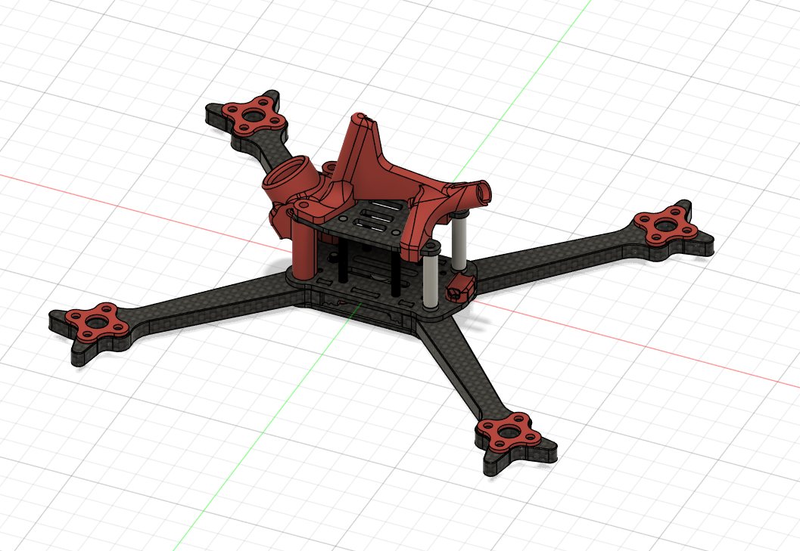
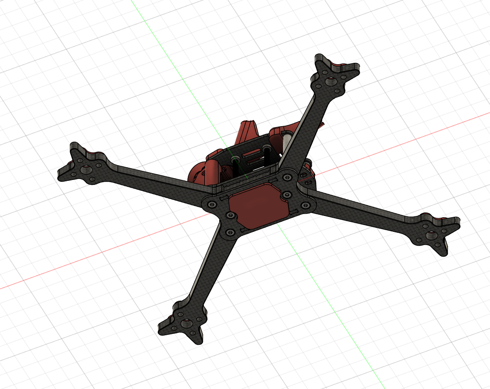
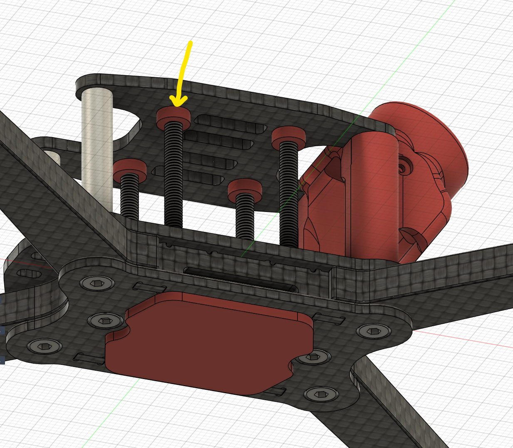

3D prints to fit the frame

- Camera Mount, Nano90V2 55deg , also with parametric fixed angle in Fusion360 model
- Horn and Antenna Mount
- Pigtail plate
- Stack nuggins
- Motor spacers
- Battery Docking Pad

