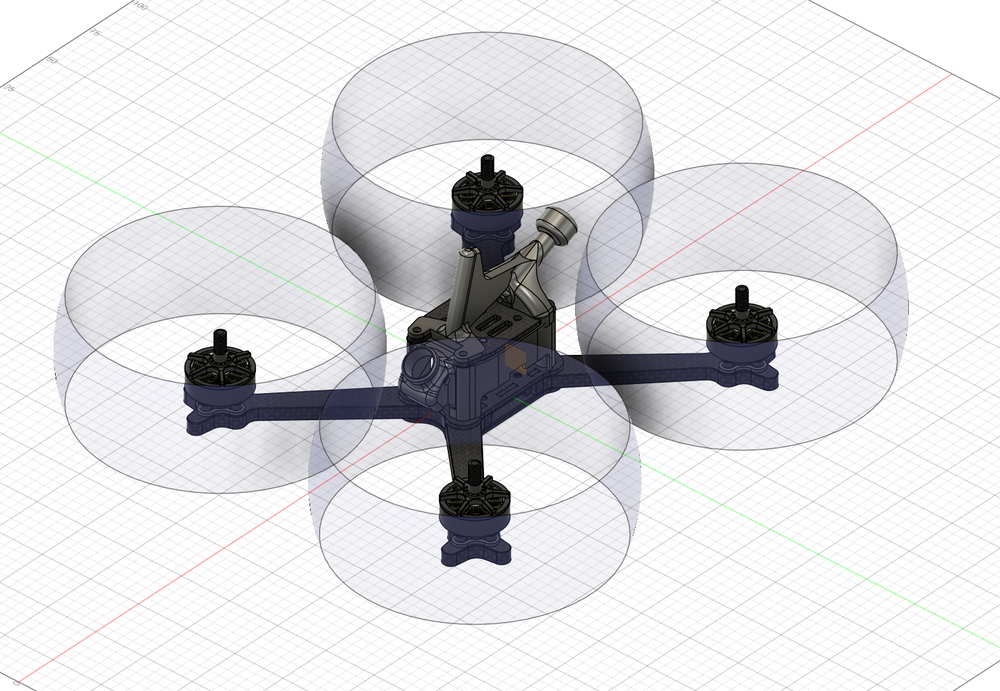
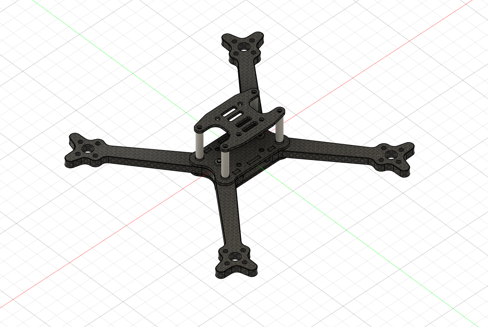
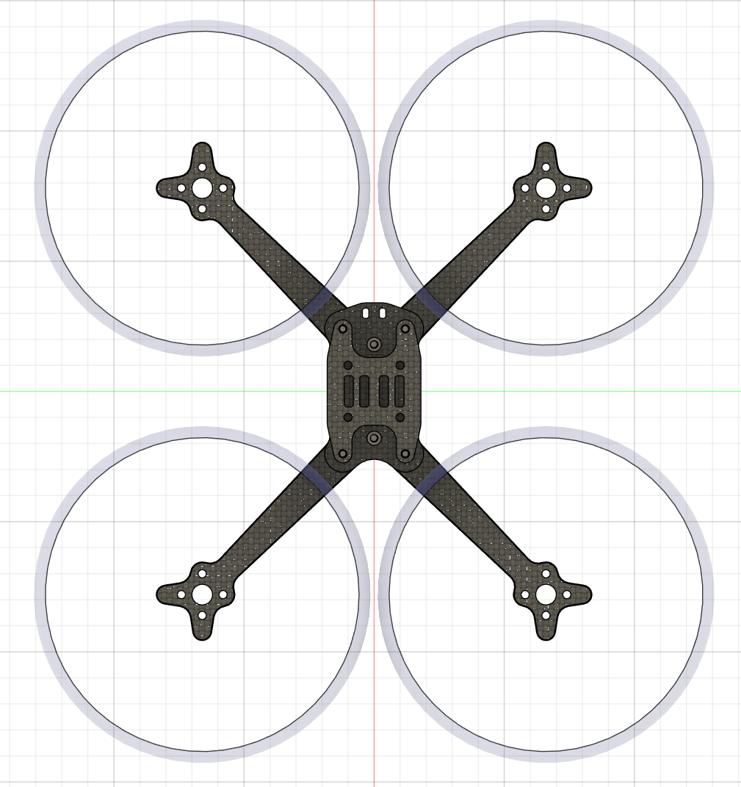
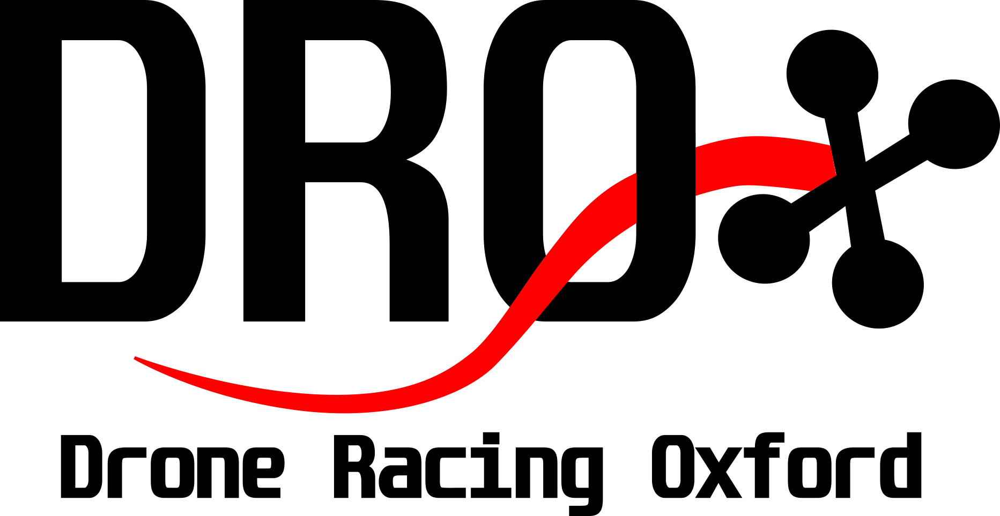

This is information about the fpv frame

Latest updates:
- Arm width increased and made more uniform along length, arm V web radius increased 
- Arm V-angle changed to be pure 90 degs to orientate fibres with T700 weave NB - this is now a stretch X frame and will require different pitch and roll tuning. Rear motors should have cleaner air with extra proximity to the front motor wakes.
- Mid plate now has pigtail cable tie holes for strain relief
- VTX is has no fixings but is held on stack with tpu nubs on underside of top plate
- Aerial and Fin print is designed for a Rush Cherry 2
  

