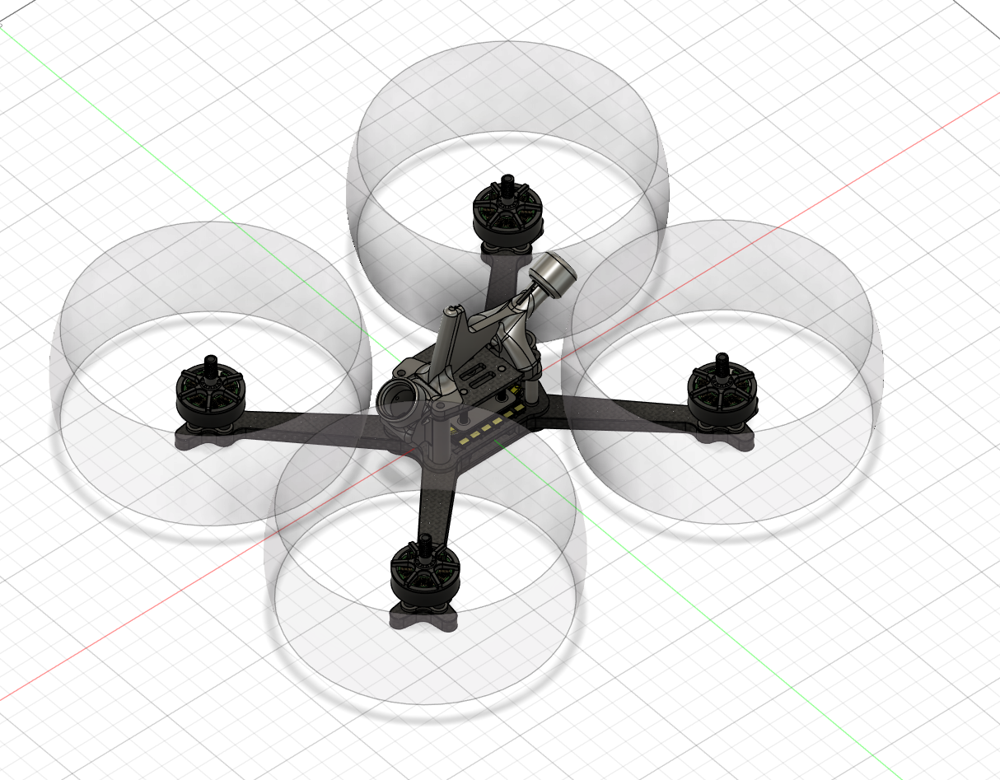
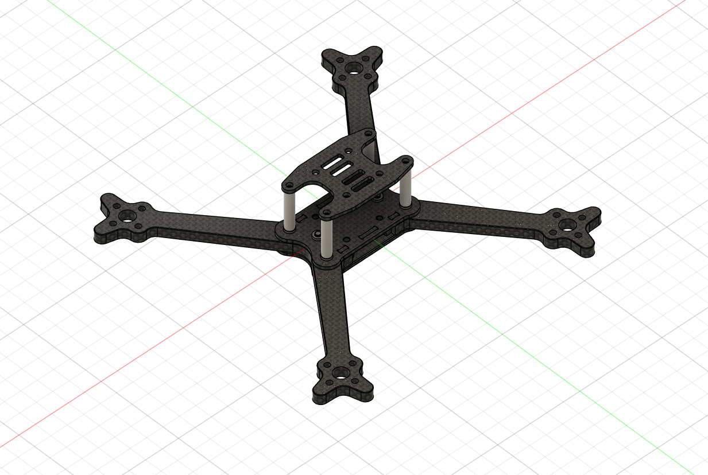
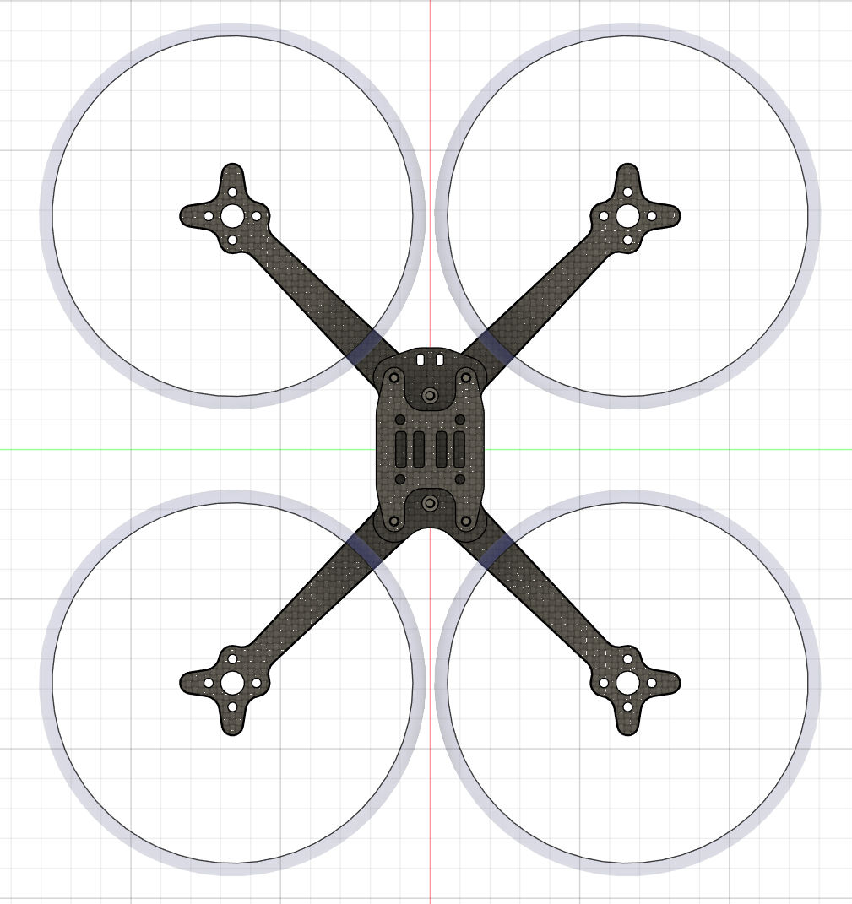
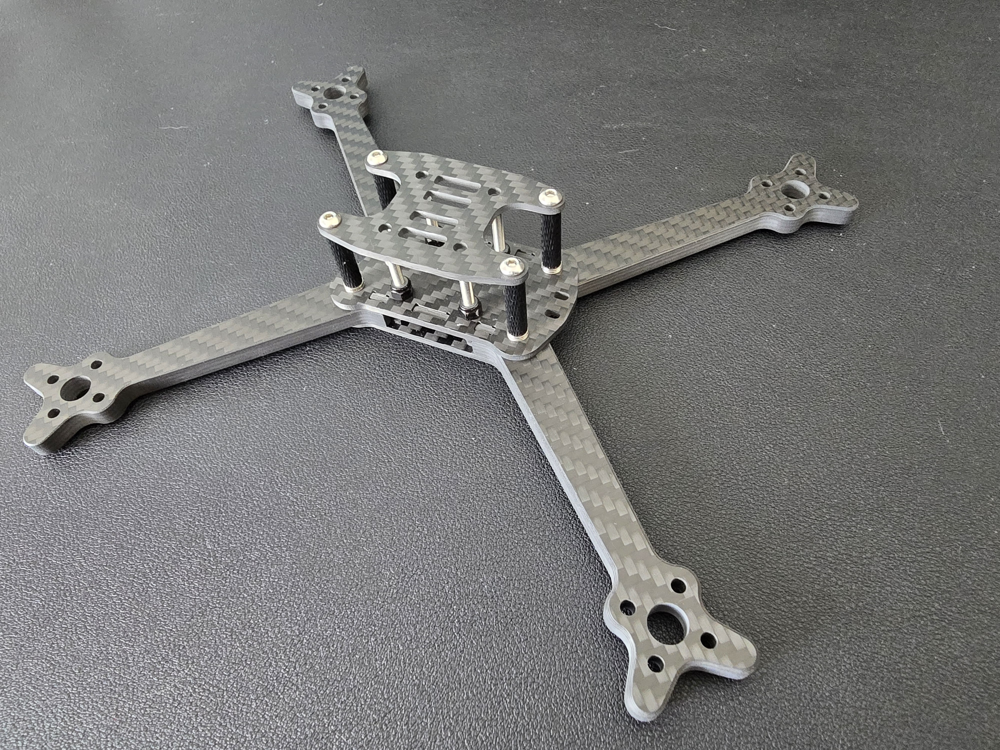
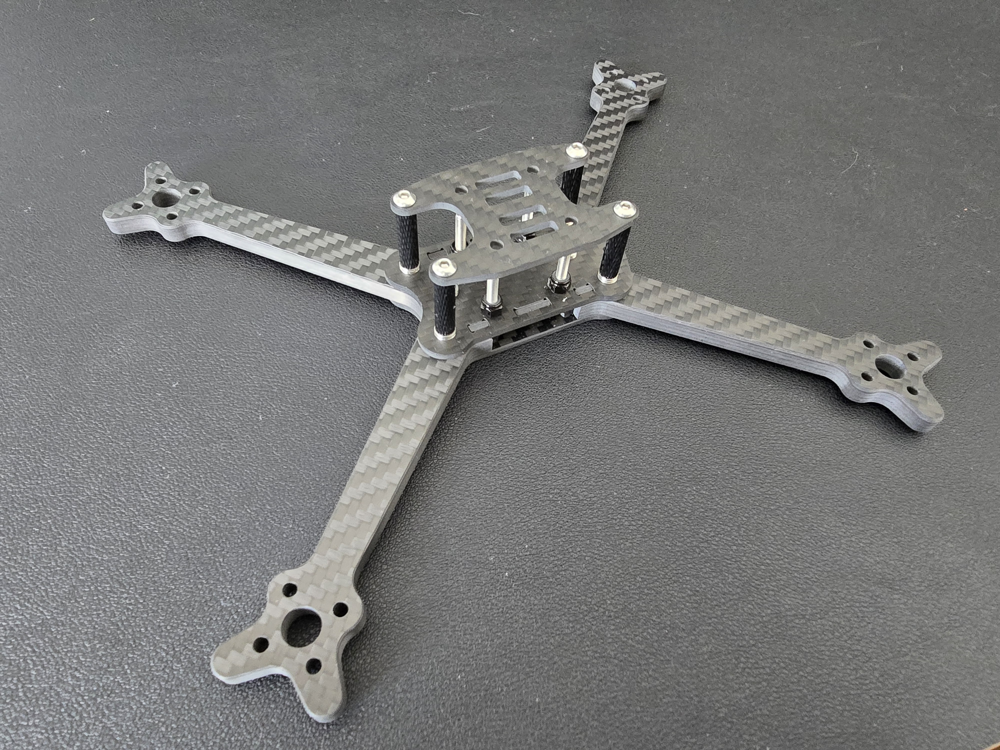

The aim of this frame design was to create something:
 - Opensource so that the community benefits both in shared design improvements but also in availability and cost through multiple manufacturing paths.
 - 20x20mm compatible.
 - Some extra space to allow all ESC types to fit. A little extra body width and standoff spacing is a small cost for wider compatibility.
 - Strong enough to survive a few hard crashes yet still flies well enough to be comptitive at the cost of a few grams. More flying = flying faster!
 - The arms are boomerang since this stiffness improvement and hence handling were considered more important than changing a few extra bolts and reduced strength in the overall design.
 - A focus has been made on increasing arm and mid plate stiffness through weave orientation and configuration. Stiffer frames move the resonances to higher frequencies allowing less filtering, improved flight performance both in stick following and prop wash.
   
Latest updates:
- Arm width increased and made more uniform along length, arm V web radius increased 
- Arm V-angle changed to be pure 90 degs to orientate fibres with T700 weave NB - this is now a stretch X frame and will require different pitch and roll tuning. Rear motors should have cleaner air with extra proximity to the front motor wakes.
- Mid plate now has pigtail cable tie holes for strain relief
- Battery Strap width limited to 20mm width to increase mid plate sandwich torsional stiffness
- VTX is has no fixings but is held on stack with tpu nubs on underside of top plate
- Aerial and Fin print is designed for a Rush Cherry 2
  
Specs:
- Motor to Motor Left Right = 132.1 mm
- Motor to Motor Front Back = 156.1 mm
- Motor to Motor Diagonal = 204.5 mm
- Standoff Spacing Left Right = 24 mm
- Standoff Spacing Front Back = 48 mm
- Battery Strap Width = 20 mm
- Arm Thickness = 6mm
- Arm Angle = 90 deg
- Mid Plate Width = 34 mm
- Motor Mount Diagonal = 16 mm (22xx motors)
- Weight (Including hardware) = 81g

