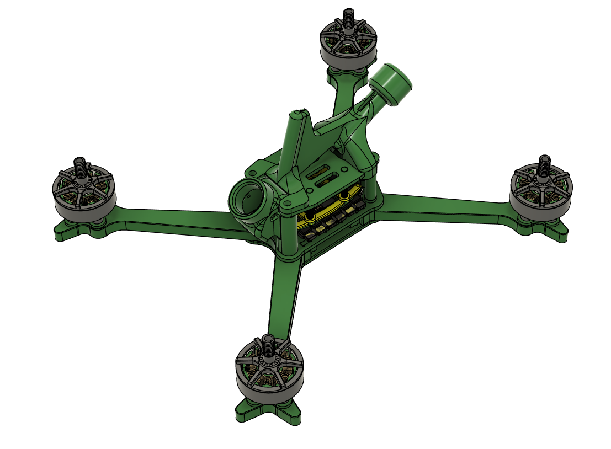

Version 1

- Initial release of the frame
- Arms failures regular from torsional delamination failure
- Some arm bending modes needed the filters to be set up carefully

Version 2

- Arm width increased and made more uniform along length, arm V web radius increased 
- Arm V-angle changed to be pure 90 degs to orientate fibres with T700 weave NB - this is now a stretch X frame and will require different pitch and roll tuning. Rear motors should have cleaner air with extra proximity to the front motor wakes.
- Mid plate now has pigtail cable tie holes for strain relief
- Battery Strap width limited to 20mm width to increase mid plate sandwich torsional stiffness
- VTX is has no fixings but is held on stack with tpu nubs on underside of top plate
- Aerial and Fin print is designed for a Rush Cherry 2

Version 3

- Due to the much increased strength and stiffness of the V2 the arms have been made narrower for weight saving
- Mid plate includes fixing holes for Gorilla Mounting ESC
- Bottom plate includes holes for stack bolt access and also to act as a docking pattern for battery pads
- Chassis weight (all hardware is estimate to be ~72g - 16% reduction from V2

